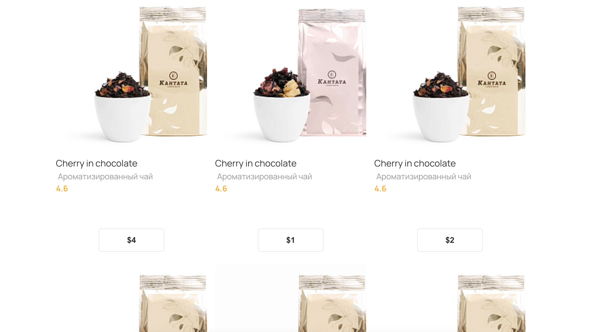
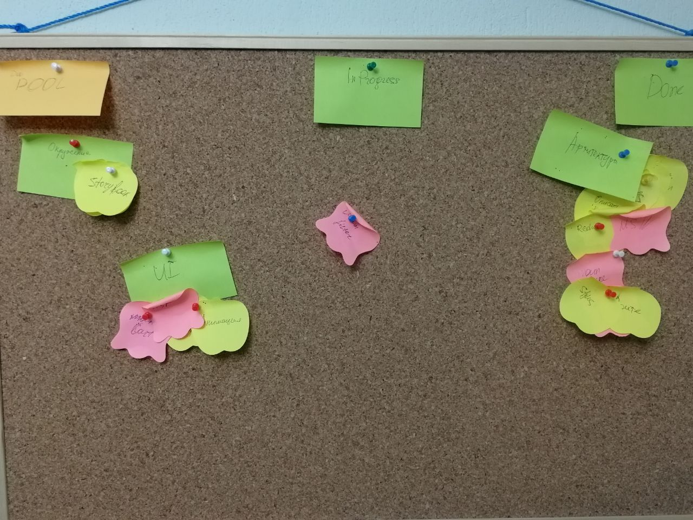

# Online tea store

> This app is a work in progress. The roadmap below.

- React, Redux Toolkit, MSW
- Vite, TypeScript, Postcss

## Live demo at current version 1.1.0



## About project

[Test task](https://triangular-team-7b7.notion.site/Test-task-6d60e05aa6a44b63be8084823b7b5726) - React/Redux App

# Roadmap




- [x] Product page
- [ ] Product's sorting feature
- [ ] Add cart feature
- [ ] Cart page
- [ ] Order logic
- [ ] Card mask logic
- [ ] Address feature logic

## How to start

1. Install

```bash
pnpm install
```

2. Start Vite

```bash
npm start
```

## License

Licensed under the MIT license.

## Additional
For correct usage use
node v18.16.0 (npm v9.5.1)
